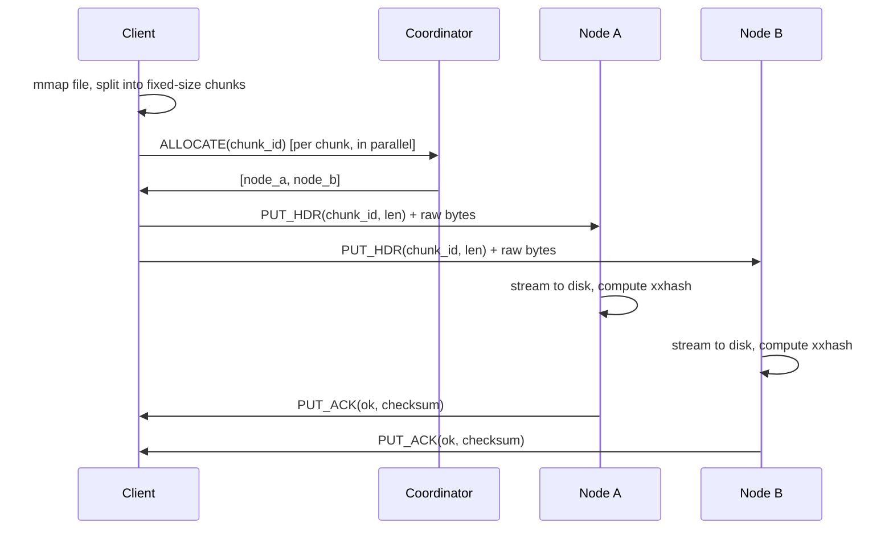
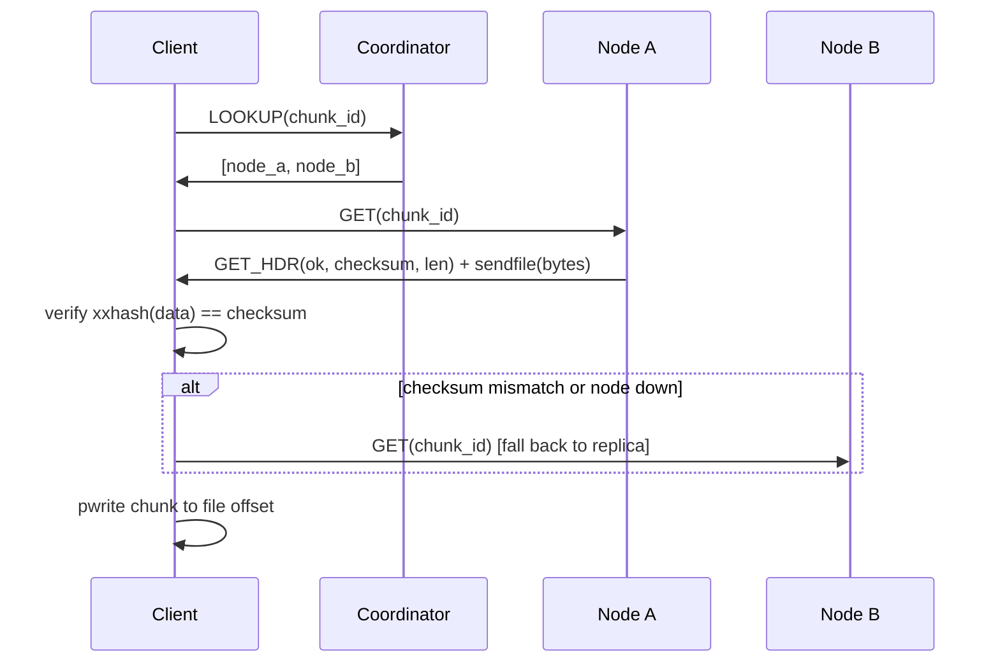

# DFS — A Replicated Distributed File System in C++

A lightweight distributed file system that splits files into fixed-size chunks,
replicates each chunk across N storage nodes, and coordinates everything through a
metadata-only master that sits **out of the data path**. Built with plain POSIX
sockets, `mmap`/`sendfile` zero-copy I/O, and `xxhash` checksums. No gRPC, no
external deps beyond `libxxhash`.

---

## Architecture

Three processes talk over TCP with a shared binary protocol (`common/`):

```
┌─────────┐  metadata (allocate / lookup)  ┌──────────────┐
│  Client │ ─────────────────────────────▶ │  Coordinator │
│         │                                │  (master)    │
│         │  ────────────────────────┐     └──────┬───────┘
└─────────┘                          │            │ replicate cmd (on failure)
     │  │                            │            ▼
     │  │  data (streaming)          │     ┌──────────────┐
     │  └──────────────┐            │     │   Node C     │
     │                 ▼            ▼     └──────────────┘
     │           ┌──────────┐  ┌──────────┐        ▲
     └─────────▶ │  Node A  │  │  Node B  │ ◀──────┘ chunk copy (node→node)
                 └──────────┘  └──────────┘
```

**Key invariant:** chunk bytes never pass through the coordinator. Clients stream
data straight to/from storage nodes; the coordinator only answers *"which nodes
hold chunk X?"*.

### Component overview

```text
                        ┌────────────────────────────────────┐
                        │            Coordinator             │
                        │   nodes_  : id -> addr/port        │
                        │   chunks_ : id -> [replica ids]    │
                        │   WAL     : append-only journal    │
                        │   threads : monitor + repair       │
                        └────────▲───────────────┬───────────┘
            ALLOCATE / LOOKUP    │               │ REPLICATE cmd
                  ┌──────────────┘               ▼
                  │                       ┌──────────────┐
            ┌─────┴─────┐   PUT/GET data  │    Node B    │
            │  Client   │ ──────────────▶ │  (storage)   │
            └───────────┘                 └──────────────┘
                  │                              ▲
                  │       PUT/GET data            │ GET (chunk copy)
                  └───────────────▶ ┌────────────┴─────┐
                                    │     Node A       │
                                    └──────────────────┘
```

### Threading model

| Process | Threads |
|---|---|
| **Coordinator** | accept loop (one thread per connection), heartbeat `monitor_loop`, `repair_loop`, journal `fsync` |
| **Node** | accept loop (one thread per connection), `heartbeat_loop` |
| **Client** | `ThreadPool` for parallel chunk transfer (2-phase: allocate, then stream) |

---

## Data flow

### PUT (upload)



- Chunk data is sent straight from the `mmap` region — no intermediate buffer.
- Every chunk is written to **2 nodes concurrently** (replication factor = 2).

### GET (download)



- Nodes serve reads with `sendfile` (kernel file→socket, zero user-space copies).
- The client verifies every chunk against its stored `xxhash` and **falls back to
  the replica** on corruption or connection failure.

---

## Failure handling

### Heartbeats & re-replication

1. Nodes send a `HEARTBEAT` to the coordinator every **2 s**.
2. The coordinator's `monitor_loop` marks a node **DEAD** if no heartbeat arrives
   within a timeout (default **5 s**).
3. For every chunk the dead node held, the coordinator picks a new least-loaded
   node and sends it a `REPLICATE{chunk_id, source_addr, source_port}` command.
4. The target node **pulls the chunk directly from the surviving replica**
   (node→node), verifies the checksum, and acks. Only then does the coordinator
   commit the new placement to metadata + journal.

> Re-replication is *coordinated* by the master but *executed* node-to-node, so
> chunk data still never transits the master.

### Coordinator crash recovery (WAL)

The coordinator persists every metadata mutation to an **append-only journal**:

```
REG   1 127.0.0.1 9101          node came online
REG   2 127.0.0.1 9102
CHUNK f:0 1 2                   chunk f:0 has replicas on nodes 1, 2
```

On restart it replays the journal to reconstruct `nodes_`, `chunks_`, and
`next_node_id_`, then recomputes per-node load counters. **Files remain readable
after a coordinator restart with no re-upload.**

### Checksum integrity

- Every chunk is hashed with `XXH64` on write and stored in a `.sum` sidecar.
- Reads re-hash and compare; a mismatch triggers replica fallback.
- Re-replication re-verifies the copied bytes, so a corrupt replica is **never
  propagated** to a healthy node.

---

## Wire protocol

Length-prefixed frames over TCP: `[u32 payload_len][u32 type][payload]`.
Chunk data travels as a **raw byte stream** after a small header frame (so chunk
bytes are never copied into a message buffer).

| Type | Direction | Payload |
|---|---|---|
| `REGISTER` / `ACK` | node ↔ coord | data port, node id |
| `HEARTBEAT` | node → coord | node id |
| `ALLOCATE` / `RESP` | client ↔ coord | chunk id → replica list |
| `LOOKUP` / `RESP` | client ↔ coord | chunk id → replica list |
| `REPLICATE` / `ACK` | coord ↔ node | chunk id, source addr, ok |
| `PUT_HDR` / `PUT_ACK` | client ↔ node | chunk id, len → checksum |
| `GET` / `GET_HDR` | client ↔ node | chunk id → checksum, len |

---

## Build & run

```bash
# build
cmake -S . -B build -DCMAKE_BUILD_TYPE=Release
cmake --build build -j

# run the full demo: 1 coordinator + 4 nodes, then PUT/GET/benchmark
./run.sh 4 [chunk_size] [threads]

# cold / durable benchmark on the NVMe disk (drops page cache)
./bench_cold.sh

# stop everything
./stop.sh
```

Manual launch:

```bash
build/dfs_coordinator 9000 5000 2 /tmp/coord.journal   # port, timeout, rf, journal
build/dfs_node 127.0.0.1 9000 9101 /tmp/data/n1        # host, port, data_port, dir
build/dfs_node 127.0.0.1 9000 9101 /data/n1 1          # ... last arg 1 = fsync writes
build/dfs_client 127.0.0.1 9000 put  file.bin  demo.bin 4194304 8
build/dfs_client 127.0.0.1 9000 get  demo.bin  out.bin  8
build/dfs_client 127.0.0.1 9000 bench 128 4194304 8 1   # size_mb, chunk, threads, clients
```

---

## Benchmarks

NVMe-backed (node data on `/dev/nvme0n1`, *not* `/tmp` tmpfs), 4 storage nodes,
256 MB file, 16 threads. Measured with `./bench_cold.sh`:

| Operation | Throughput |
|---|---|
| PUT — buffered (write-back) | ~0.9 GB/s |
| PUT — durable (`fsync` before ack) | ~0.8 GB/s |
| GET — hot (page cache) | ~1.4 GB/s |
| GET — cold (`drop_caches`) | ~1.4 GB/s |

Throughput is roughly flat across chunk sizes once the zero-copy path is active
(page-cache numbers, 16 threads, 512 MB file):

| chunk | PUT | GET |
|---|---|---|
| 1 MB | 1.72 GB/s | 4.96 GB/s |
| 4 MB | 1.52 GB/s | 4.29 GB/s |
| 16 MB | 1.73 GB/s | 5.10 GB/s |
| 64 MB | 1.84 GB/s | 4.65 GB/s |

Notes:
- **GET is bound by the client** (receive + `xxhash` verify + `pwrite`), not the
  node's disk — hot and cold reads are identical on a fast NVMe.
- **Durable writes cost only ~10%** over buffered, since NVMe `fsync` is cheap.
- The second table is a *page-cache* ceiling; the first is honest disk-backed
  throughput.

---

## Known limitations

- **Coordinator is a single point of failure** — the WAL survives a crash, but there
  is no leader election/replica (a Raft-based metadata service would be the fix).
- **Journal grows unbounded** — no checkpoint/compaction yet; every `CHUNK` line is
  a full replica list, and replay just takes the last one.
- **No journal record checksums** — a torn final write would abort replay.
- **Node metadata not persisted** — a node restart re-registers but must re-learn
  nothing (chunks are content-addressed on disk); no node-side journal.
- **Chunk size must be uniform** per file (derived from chunk 0 on read).

## Layout

```
common/        protocol + serialization, socket helpers
coordinator/   metadata master, WAL, heartbeat monitor, repair
node/          chunk store (sendfile/streaming), heartbeat sender
client/        mmap + thread-pool transfer, checksum verify + fallback
run.sh         local multi-node demo + benchmark
bench_cold.sh  NVMe-backed cold/durable benchmark (drops page cache)
stop.sh        kill leftovers
```
